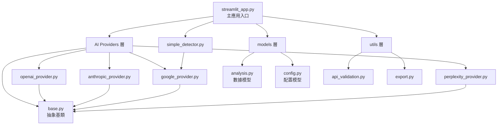
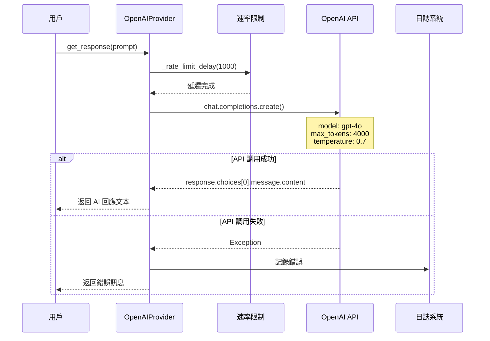
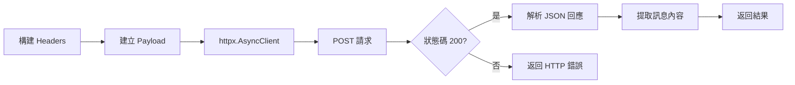
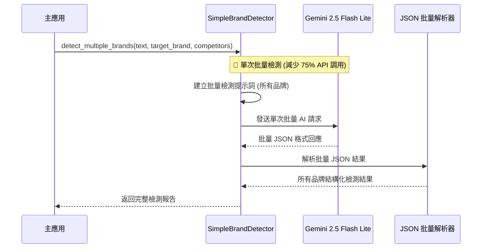
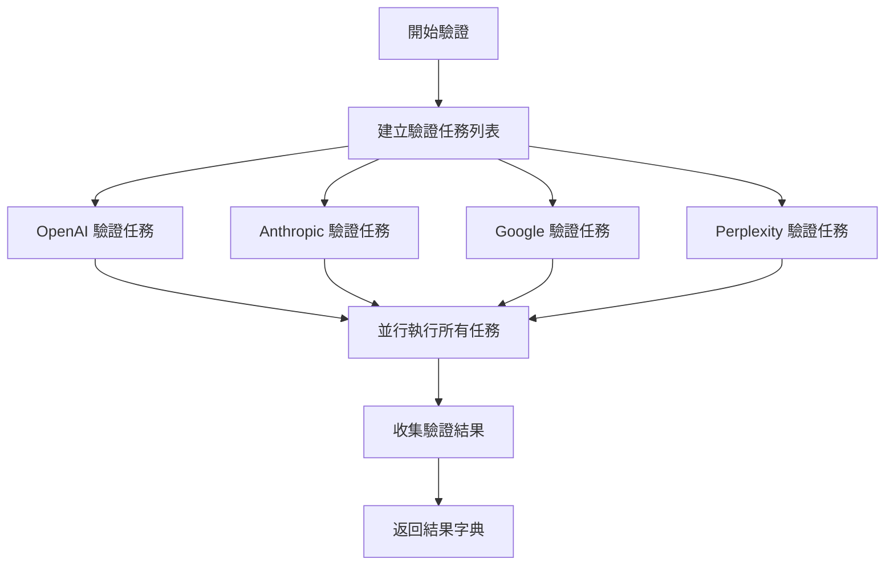
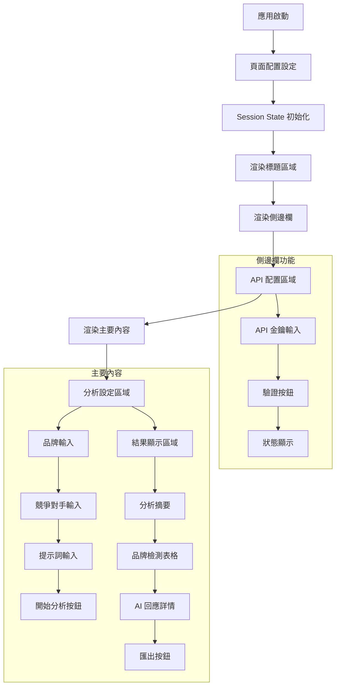
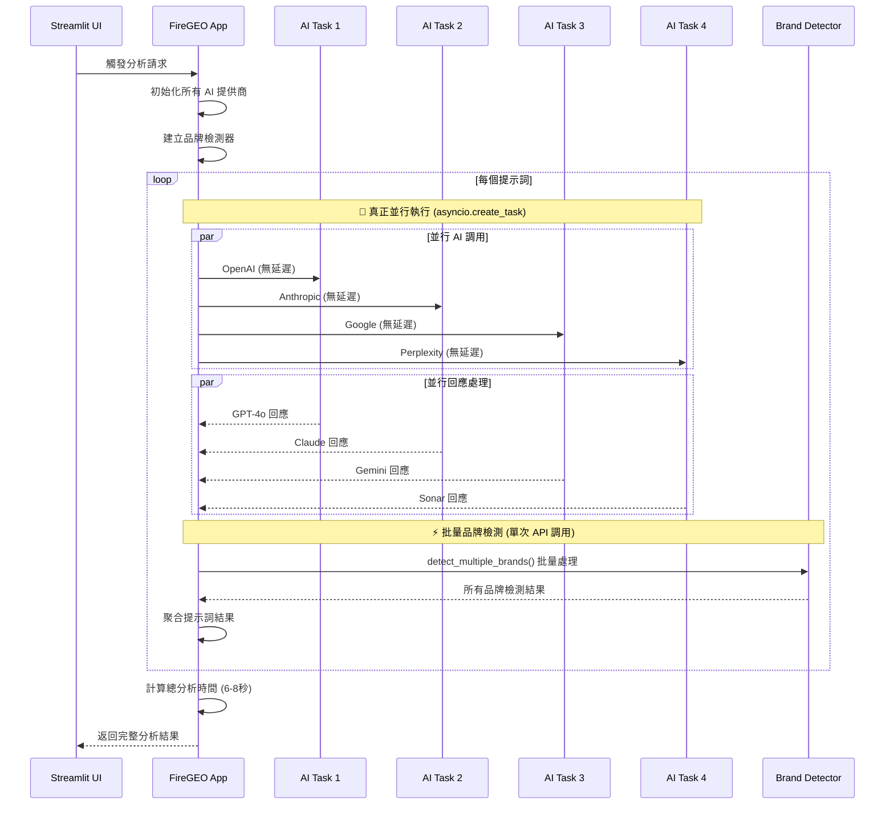

# 🔍 FireGEO Python 程式碼分析與流程圖

這份文件詳細分析每個 Python 檔案的功能、依賴關係和執行流程，並提供清晰的流程圖說明。

## 🚀 v2.1.0 高性能版本更新說明

**重要性能優化**:
- ⚡ **80% 性能提升**: 分析時間從 35-40 秒縮短至 6-8 秒
- 🚀 **真正並行處理**: 使用 `asyncio.create_task()` 實現 AI 提供商並行調用
- ⚡ **批量品牌檢測**: 減少 75% API 調用（從 16 次降至 4 次）
- 🔥 **移除速率限制**: 取消不必要的延遲，最大化響應速度

## 📁 檔案總覽

### 核心架構依賴關係圖



---

## 🔧 核心 Python 檔案詳細分析

### 1. 🏗️ `src/firegeo/core/ai_providers/base.py`

**檔案職責**: AI 提供商抽象基類，定義統一介面

#### 流程架構圖
```
┌─────────────────────────────────────────────────────────┐
│                BaseAIProvider 基類                        │
├─────────────────────────────────────────────────────────┤
│  📋 核心功能：                                            │
│  ├── __init__() → 初始化 API 金鑰和時間戳記                │
│  ├── provider_name() → 抽象屬性：提供商名稱                │
│  ├── get_response() → 抽象方法：獲取 AI 回應               │
│  ├── is_available() → 抽象方法：檢查可用性                 │
│  └── _rate_limit_delay() → 速率限制實現                   │
│                                                         │
│  🔄 速率限制流程：                                        │
│  ┌─────────────────────────────────────────────────┐   │
│  │ 計算最小間隔 → 檢查時間差 → 必要時等待 → 更新時戳記  │   │
│  └─────────────────────────────────────────────────┘   │
└─────────────────────────────────────────────────────────┘
```

#### 依賴關係
- `abc.ABC`: 抽象基類支援
- `asyncio`: 非同步延遲功能  
- `time`: 時間計算
- `logging`: 日誌記錄

#### 關鍵方法流程

**速率限制流程 (`_rate_limit_delay`)**:
```
開始 → 檢查 RPM > 0? → 計算最小間隔 → 獲取當前時間 → 
計算時間差 → 需要延遲? → 異步等待 → 更新時戳記 → 結束
```

---

### 2. 🤖 `src/firegeo/core/ai_providers/openai_provider.py`

**檔案職責**: OpenAI GPT-4o 模型整合實現

#### 主要流程圖


#### 核心特色
- **模型**: GPT-4o (最新版本)
- **速率限制**: 1000 RPM (每分鐘請求數)
- **HTTP 客戶端**: httpx (內建於 openai 庫)
- **錯誤處理**: 完整的異常捕獲與日誌記錄

---

### 3. 🧠 `src/firegeo/core/ai_providers/google_provider.py`

**檔案職責**: Google Gemini 2.5 Flash 模型整合

#### 特殊處理流程
```mermaid
flowchart TD
    A[接收提示詞] --> B[執行速率限制檢查<br/>120 RPM]
    B --> C[創建同步函數<br/>_sync_call()]
    C --> D[使用 run_in_executor<br/>異步執行同步 API]
    D --> E[genai.GenerativeModel.generate_content]
    E --> F{API 回應成功?}
    F -->|是| G[返回 response.text]
    F -->|否| H[捕獲異常]
    H --> I[記錄錯誤日誌]
    I --> J[返回錯誤訊息]
    G --> K[記錄成功日誌]
    K --> L[返回結果]
```

#### 技術亮點
- **異步包裝**: 使用 `loop.run_in_executor()` 包裝同步 API
- **HTTP 客戶端**: requests (內建於 google-generativeai 庫)
- **日誌記錄**: 詳細的調用和回應日誌
- **模型配置**: gemini-2.5-flash (生產版本)

---

### 4. 🎭 `src/firegeo/core/ai_providers/anthropic_provider.py`

**檔案職責**: Anthropic Claude Sonnet 4.0 模型整合

#### API 調用流程
```
提示詞輸入 → 速率限制(100 RPM) → 建立訊息請求 → 
Claude API 調用 → 提取回應內容 → 返回結果
```

#### 配置參數
- **模型**: claude-sonnet-4-0 (最新版本)
- **最大 Tokens**: 4000
- **溫度**: 0.7
- **速率限制**: 100 RPM

---

### 5. 🌐 `src/firegeo/core/ai_providers/perplexity_provider.py`

**檔案職責**: Perplexity Sonar 模型整合

#### HTTP 請求流程


#### 技術實現
- **HTTP 客戶端**: 直接使用 httpx.AsyncClient
- **端點**: https://api.perplexity.ai/chat/completions
- **模型**: sonar
- **超時設定**: 60 秒

---

### 6. 🔍 `src/firegeo/core/simple_detector.py`

**檔案職責**: 簡化品牌檢測器，使用 Gemini 2.5 Flash

#### ⚡ 批量品牌檢測流程 (v2.1.0 優化)


#### 提示詞範本
```python
BRAND_DETECTION_PROMPT = """
請分析以下文本中是否提及了品牌 "{brand_name}"。

文本: {text}
問題背景: {question}

請以 JSON 格式回應:
{
    "brand_mentioned": true/false,
    "reasoning": "詳細說明分析理由"
}
"""
```

---

### 7. 📊 `src/firegeo/models/analysis.py`

**檔案職責**: Pydantic 數據模型定義

#### 數據模型架構
```
SimpleAnalysisRequest
├── target_brand: str (目標品牌)
├── competitors: List[str] (競爭對手列表)  
├── prompts: List[str] (分析提示詞)
└── api_keys: Dict[str, str] (API 金鑰字典)

BrandDetectionResult  
├── brand_name: str (品牌名稱)
├── mentioned: bool (是否提及)
├── reasoning: str (分析理由)
└── confidence_score: float = 1.0 (信心分數)

AIProviderResponse
├── provider: str (提供商名稱)
├── prompt: str (原始提示詞)
├── response_text: str (AI 回應內容)
├── brand_detections: List[BrandDetectionResult] (品牌檢測結果)
├── processing_time: float = 0.0 (處理時間)
└── error: Optional[str] = None (錯誤訊息)
```

---

### 8. ⚙️ `src/firegeo/models/config.py`

**檔案職責**: 系統配置模型和常數定義

#### 配置架構
```
StreamlitConfig
├── page_title: str = "FireGEO Brand Analysis"
├── page_icon: str = "🔥"  
├── layout: str = "wide"
└── initial_sidebar_state: str = "expanded"

SUPPORTED_PROVIDERS
├── "openai" → ProviderInfo(name="OpenAI", model="gpt-4o", color="#10A37F")
├── "anthropic" → ProviderInfo(name="Anthropic", model="claude-sonnet-4-0", color="#D97757")
├── "google" → ProviderInfo(name="Google", model="gemini-2.5-flash", color="#4285F4") 
└── "perplexity" → ProviderInfo(name="Perplexity", model="sonar", color="#20B2AA")
```

---

### 9. 🔐 `src/firegeo/utils/api_validation.py`

**檔案職責**: API 金鑰驗證工具

#### 並行驗證流程


#### 驗證策略
- **OpenAI**: 嘗試列出模型 (`client.models.list()`)
- **Anthropic**: 發送簡短測試訊息
- **Google**: 使用 `gemini-2.5-flash-lite` 生成內容
- **Perplexity**: HTTP POST 到 chat/completions 端點

---

### 10. 📤 `src/firegeo/utils/export.py`

**檔案職責**: 分析結果匯出功能

#### 匯出流程
```
SimpleAnalysisResult → 選擇格式 → JSON/CSV 轉換 → 返回可下載內容
```

#### 支援格式
- **JSON**: 完整結構化數據 (`model_dump_json()`)
- **CSV**: 扁平化表格數據 (pandas DataFrame)

---

### 11. 🎛️ `src/firegeo/streamlit_app.py`

**檔案職責**: Streamlit 主應用程式

#### 應用架構流程


#### 核心方法流程

**🚀 高性能並行分析流程 (`_analyze_brand`) - v2.1.0 優化版本**:


---

## 🧪 測試檔案分析

### `quick_test.py` - 快速驗證腳本

#### 驗證流程
```
開始測試 → 模型導入測試 → AI 提供商導入測試 → 
配置測試 → 品牌檢測器測試 → 結果統計 → 顯示總結
```

#### 測試項目
1. **Models import**: 驗證 `firegeo.models.analysis` 模組
2. **AI Providers import**: 驗證 `firegeo.core.ai_providers.OpenAIProvider`
3. **Configuration**: 驗證 `SUPPORTED_PROVIDERS` 包含 4 個提供商
4. **Brand Detector**: 驗證 `firegeo.core.simple_detector.SimpleBrandDetector`

---

## 🚀 啟動腳本分析

### `start_app.py` - 專用啟動腳本

#### 啟動流程
```python
設定 PYTHONPATH → 設定環境變數 → 執行 subprocess → 
運行 streamlit with 正確路徑
```

### `run_streamlit.py` - Streamlit 啟動腳本  

#### 啟動流程
```python
添加 src 到 sys.path → 導入 main 函數 → 執行應用
```

---

## 📋 配置檔案分析

### `pyproject.toml` - 專案配置

#### 關鍵設定
- **Python 版本**: >=3.11
- **主要依賴**: streamlit, pydantic, openai, anthropic, google-generativeai, httpx
- **開發依賴**: pytest, black, isort, mypy
- **腳本入口**: `firegeo-streamlit = "firegeo.streamlit_app:main"`

### `.env` 檔案結構
```
# AI 提供商 API 金鑰
OPENAI_API_KEY=sk-...
ANTHROPIC_API_KEY=sk-ant-...
GOOGLE_GENERATIVE_AI_API_KEY=...
PERPLEXITY_API_KEY=pplx-...

# 應用設定
APP_HOST=127.0.0.1
APP_PORT=8501
DEBUG=false
```

---

## 🔄 整體執行流程總結

### 應用啟動到分析完成的完整流程

```mermaid
graph TD
    A[用戶執行 start_app.py] --> B[Streamlit 應用啟動]
    B --> C[載入 streamlit_app.py]
    C --> D[初始化頁面配置]
    D --> E[用戶輸入 API 金鑰]
    E --> F[驗證 API 金鑰]
    F --> G[用戶設定分析參數]
    G --> H[點擊開始分析]
    
    H --> I[建立 AI 提供商實例]
    I --> J[建立品牌檢測器]
    J --> K[並行處理多個提示詞]
    
    K --> L[🚀 真正並行調用 AI (asyncio.create_task)]
    L --> M[OpenAI GPT-4o 回應 (無延遲)]
    L --> N[Anthropic Claude 回應 (無延遲)] 
    L --> O[Google Gemini 回應 (無延遲)]
    L --> P[Perplexity Sonar 回應 (無延遲)]
    
    M --> Q[⚡ Gemini 批量品牌檢測 (單次 API)]
    N --> Q
    O --> Q  
    P --> Q
    
    Q --> R[聚合檢測結果]
    R --> S[生成分析報告 (總時間 6-8秒)]
    S --> T[顯示結果表格]
    T --> U[提供匯出選項]
```

### 關鍵技術特點

1. **🚀 高性能並行處理**: 所有 AI API 調用真正並行執行 (v2.1.0 優化)
2. **⚡ 批量品牌檢測**: 單次 API 調用處理所有品牌 (減少 75% API 調用)
3. **🔥 速率限制移除**: 取消不必要的延遲，提升響應速度
4. **🎯 智能品牌檢測**: 統一使用 Gemini 進行 AI 驅動檢測
5. **🛡️ 錯誤恢復**: 單一提供商失敗不影響整體分析
6. **📊 結果聚合**: 多維度分析結果整合
7. **📤 數據匯出**: 支援 JSON 和 CSV 格式

### 檔案依賴優先級

```
1. base.py (基礎抽象類別)
2. *_provider.py (各 AI 提供商實現)
3. models/*.py (數據模型)
4. simple_detector.py (品牌檢測邏輯)
5. utils/*.py (工具函數)
6. streamlit_app.py (主應用整合)
```

這個分析涵蓋了 FireGEO Python 專案的所有核心檔案，每個檔案的功能、依賴關係和執行流程都有詳細的流程圖說明。