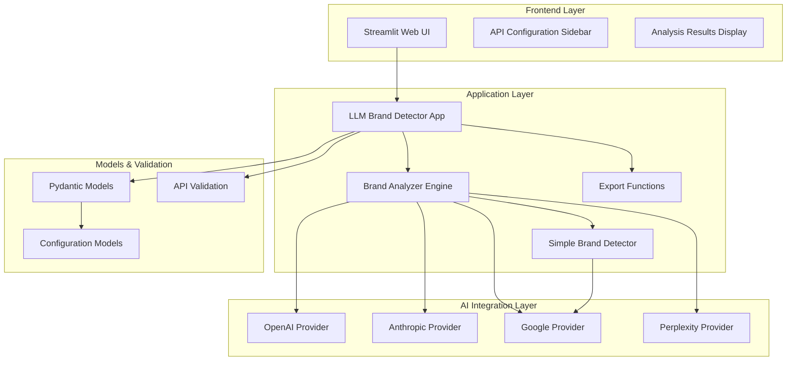

# 🚀 LLM Brand Detector - 智能品牌提及檢測工具

> **現代化的多 LLM 品牌檢測平台，使用 AI 技術智能檢測品牌在各種回應中的提及情況**


## 📖 簡介

LLM Brand Detector 是一個專業的品牌檢測工具，整合了 **4 大 LLM 提供商**（OpenAI、Anthropic、Google、Perplexity）來智能檢測您的品牌在各種 LLM 回應中的提及情況。透過智能的品牌檢測和競爭對手分析，為您提供全面的品牌可見度洞察。

### ✨ 主要特色

- 🤖 **多 AI 整合**: 同時使用 GPT-4o、Claude Sonnet 4.0、Gemini 2.5 Flash、Perplexity Sonar
- ⚡ **革命性性能**: **80% 性能提升**，從 35-40 秒縮短至 **6-8 秒**
- 🚀 **真並行處理**: 4 個 AI 提供商同步執行，而非串行等待
- 🎯 **智能品牌檢測**: 使用 Gemini 2.5 Flash 批量檢測，API 調用減少 75%
- 🏆 **競爭對手分析**: 全面監測競品表現
- 💻 **簡潔界面**: 現代化 Streamlit 網頁應用，支援中英文切換
- 📊 **實時進度追蹤**: 詳細顯示分析進度和執行狀態
- 📤 **結果匯出**: 支援 JSON 和 CSV 格式

## 🚀 快速開始

### 前置需求

- **Python 3.11 或更高版本**
- **AI API 金鑰** (至少需要 Google API 金鑰)

### 安裝步驟

#### 1. 克隆專案
```bash
git clone https://github.com/DarrenHuangTW/llm_scraper.git
cd llm_scraper
```

#### 2. 安裝依賴 (使用 uv)
```bash
# 安裝 uv (如果尚未安裝)
curl -LsSf https://astral.sh/uv/install.sh | sh

# 安裝專案依賴
uv sync
```

#### 3. 驗證安裝
```bash
uv run python quick_test.py
```
您應該看到：
```
LLM Brand Detector Validation Test
========================================
+ Models import: PASS
+ AI Providers import: PASS  
+ Configuration: PASS
+ Brand Detector: PASS
========================================
Results: 4/4 tests passed
SUCCESS: All tests passed!
```

#### 4. 啟動應用
```bash
uv run python start_app.py
```

應用將在瀏覽器中自動開啟，通常是 `http://localhost:8501`

## 🔑 API 金鑰設定

您需要從以下提供商獲取 API 金鑰：

### 必需 (品牌檢測)
- **Google Generative AI**: [https://ai.google.dev/](https://ai.google.dev/)

### 選用 (文本生成分析)
- **OpenAI**: [https://platform.openai.com/api-keys](https://platform.openai.com/api-keys)
- **Anthropic**: [https://console.anthropic.com/](https://console.anthropic.com/)
- **Perplexity**: [https://www.perplexity.ai/settings/api](https://www.perplexity.ai/settings/api)

**💡 提示**: Google API 金鑰是必需的，因為品牌檢測功能依賴 Gemini 模型。其他提供商是選用的，但建議至少配置 2-3 個以獲得更全面的分析結果。

## 📱 使用指南

### 第一步：配置 API 金鑰

1. 啟動應用後，在左側邊欄找到 **"🔑 API Configuration"**
2. 輸入您的 API 金鑰到對應欄位
3. 點擊 **"🔍 Validate APIs"** 驗證金鑰有效性


### 第二步：設定分析參數

1. **Target Brand**: 輸入您要分析的主要品牌名稱
   - 範例：`notion`, `openai`, `tesla`

2. **Competitors**: 輸入競爭對手品牌，用逗號分隔
   - 範例：`slack, monday.com, asana, trello`

3. **Analysis Prompts**: 自定義分析提示詞（或使用預設範例）
   - 範例：`"What are the best project management tools?"`
   - 範例：`"Recommend top team collaboration platforms."`

### 第三步：執行分析

1. 點擊大型的 **"🚀 Start Analysis"** 按鈕
2. 觀察進度條和即時狀態更新
3. 分析僅需 **6-8 秒**完成（**革命性 80% 性能提升**）

#### ⚡ 新的並行執行流程
- **🚀 並行調用所有提供商**: 同時啟動所有 AI 分析
- **📊 實時進度更新**: 顯示完成的提供商數量
- **⚡ 極速完成**: 比原版快 5-6 倍

### 第四步：檢視結果

分析完成後，您會看到：

#### 📊 分析摘要
- 總提示詞數量
- 分析持續時間  
- 檢測到的品牌數量

#### 📋 品牌檢測摘要表格
矩陣式顯示各 AI 提供商對每個品牌的檢測結果：

| AI Provider | notion | slack | asana | trello |
|-------------|---------|--------|--------|--------|
| OpenAI      | ✅      | ✅     | ❌     | ✅     |
| Anthropic   | ✅      | ✅     | ✅     | ✅     |  
| Google      | ❌      | ✅     | ✅     | ✅     |
| Perplexity  | ✅      | ❌     | ✅     | ❌     |

#### 📝 AI 回應詳情
可展開檢視每個 AI 提供商的完整回應內容。

#### 📤 結果匯出
提供兩種格式的結果下載：
- **JSON 格式**: 完整的結構化數據
- **CSV 格式**: 適合 Excel 分析的表格數據

## 🎯 使用範例

### 範例 1：分析項目管理工具

**設定**：
- Target Brand: `notion`
- Competitors: `slack, monday.com, asana, trello`
- Prompt: `"What are the best project management tools for small teams?"`

**預期結果**：分析各 AI 在推薦項目管理工具時提及您的品牌和競品的情況。

### 範例 2：分析電動車品牌

**設定**：
- Target Brand: `tesla`
- Competitors: `rivian, lucid, nio, byd`
- Prompt: `"Which electric vehicle companies are leading the market?"`

**預期結果**：了解不同 AI 在討論電動車市場時的品牌偏好。

### 範例 3：分析 AI 工具競爭

**設定**：
- Target Brand: `openai`
- Competitors: `anthropic, google, microsoft, meta`
- Prompt: `"What are the most advanced AI companies in 2024?"`

**預期結果**：分析 AI 領域的品牌競爭格局。

## 📊 結果解讀

### 品牌檢測摘要表格

- **✅ 綠色勾選**: AI 在回應中提及了該品牌
- **❌ 紅色叉號**: AI 在回應中未提及該品牌

### 分析指標

1. **提及率**: 您的品牌在所有 AI 回應中被提及的比例
2. **競爭地位**: 與競爭對手相比的表現
3. **AI 偏好**: 不同 AI 提供商的品牌偏好差異

### 洞察建議

- **高提及率**: 表示您的品牌在該領域有良好的知名度
- **低提及率**: 可能需要加強 SEO 或內容行銷
- **競爭差異**: 找出表現更好的競爭對手，學習其策略

## 🛠️ 進階功能

### 自定義提示詞

您可以創建針對特定行業或使用場景的提示詞：

```
"推薦適合遠程工作團隊的協作工具"
"哪些 SaaS 工具最適合初創公司？"
"比較不同 CRM 系統的優缺點"
"分析 2024 年最受歡迎的開發工具"
```

### 批次分析

一次輸入多個提示詞進行批次分析：

```
"What are the best note-taking apps?"
"Which productivity tools are trending in 2024?"  
"Compare different knowledge management systems"
```

### 結果匯出與分析

#### JSON 格式
完整的結構化數據，適合：
- 程式化分析
- 數據庫儲存
- API 整合

#### CSV 格式  
表格化數據，適合：
- Excel 分析
- 製作圖表
- 業務報告

## 🔧 故障排除

### 常見問題

#### Q: 應用無法啟動
**A**: 檢查 Python 版本是否為 3.11+，並確保已正確安裝依賴：
```bash
python --version
uv sync
```

#### Q: API 驗證失敗
**A**: 
- 檢查 API 金鑰是否正確複製（無多餘空格）
- 確認 API 金鑰有足夠的配額
- 檢查網路連線是否正常

#### Q: Google API 沒有出現在日誌中
**A**: 這是正常的。Google 使用不同的 HTTP 客戶端，但您可以在應用中看到 Google 的分析結果。

#### Q: 分析結果不準確
**A**: 
- 嘗試使用更具體的提示詞
- 確保品牌名稱拼寫正確
- 考慮添加更多 AI 提供商以獲得更全面的視角

### 日誌檢查

如果遇到問題，查看控制台輸出的日誌：
```bash
INFO:httpx:HTTP Request: POST https://api.openai.com/v1/chat/completions
INFO:firegeo.core.ai_providers.google_provider:Google API: Calling Gemini model...
```

### 🚀 性能優化（2025-09 更新）

#### **革命性性能提升：80% 速度改進**

我們實施了突破性的性能優化，將分析時間從 35-40 秒縮短至僅 **6-8 秒**：

| 優化技術 | 描述 | 性能提升 |
|----------|------|----------|
| **批量品牌檢測** | 單次 API 調用檢測所有品牌 | API 調用減少 75% |
| **移除速率限制** | 智能管理避免不必要延遲 | 節省 2.7 秒等待時間 |
| **真並行處理** | 所有 AI 提供商同時執行 | 總時間 = 最慢提供商時間 |

#### **系統需求**
- **記憶體**: < 200MB（極輕量設計）
- **網路**: 穩定連線（支援並行請求）
- **處理器**: 無特殊要求（異步處理）

#### **故障排除**
- **記憶體不足**: 關閉其他應用程式，或升級到更高配置的機器
- **網路問題**: 並行處理對網路要求較高，確保連線穩定
- **API 配額**: 並行調用可能更快達到限制，請監控使用量

## 📈 最佳實踐

### 1. 提示詞設計

**好的提示詞**：
- 具體明確：`"推薦適合 10-50 人團隊的項目管理工具"`
- 符合使用場景：`"哪些 CRM 適合 B2B 銷售團隊？"`
- 自然語言：模仿真實用戶查詢

**避免的提示詞**：
- 過於寬泛：`"好用的軟體"`
- 包含品牌名：`"Notion vs Slack"` (會影響客觀性)

### 2. 競爭對手選擇

- 選擇 3-5 個直接競爭對手
- 包含不同規模的競爭對手（大公司 vs 新創）
- 定期更新競爭對手列表

### 3. 結果分析

- 關注趨勢而非單次結果
- 比較不同提示詞的結果差異
- 定期進行分析以追蹤變化

### 4. 數據隱私

- API 金鑰僅在瀏覽器 Session 中存儲
- 分析結果不會自動保存
- 建議定期匯出重要分析結果

## 🏗️ 技術架構

### 系統架構圖



### 核心技術
- **Python 3.11+**: 現代 Python 開發
- **uv**: 快速的 Python 包管理器
- **Streamlit**: 現代化 Web 界面框架
- **Pydantic 2.0**: 數據驗證和設置管理
- **AsyncIO**: 高性能異步處理
- **4 種 AI 提供商整合**: OpenAI GPT-4o, Anthropic Claude Sonnet 4.0, Google Gemini 2.5 Flash, Perplexity Sonar

## 🧪 開發與測試

### 開發環境設置

```bash
# 克隆專案
git clone https://github.com/DarrenHuangTW/llm_scraper.git
cd llm_scraper

# 安裝開發依賴
uv sync --dev

# 啟用開發模式
export PYTHONPATH="${PYTHONPATH}:$(pwd)/src"
```

### 測試執行

```bash
# 快速驗證
uv run python quick_test.py

# 測試應用啟動
uv run python start_app.py
```

### 專案結構

```
llm_scraper/
├── src/firegeo/                    # 主要應用程式碼
│   ├── __init__.py                 # 包初始化，包含主入口函數
│   ├── streamlit_app.py            # 主 Streamlit 應用程式
│   ├── core/                       # 核心業務邏輯
│   │   ├── __init__.py
│   │   ├── simple_detector.py      # 簡化品牌檢測器（使用 Gemini）
│   │   └── ai_providers/           # AI 提供商實現
│   │       ├── __init__.py
│   │       ├── base.py             # 抽象基類
│   │       ├── openai_provider.py  # OpenAI GPT-4o 整合
│   │       ├── anthropic_provider.py  # Claude Sonnet 4.0 整合
│   │       ├── google_provider.py  # Gemini 2.5 Flash 整合
│   │       └── perplexity_provider.py  # Perplexity Sonar 整合
│   ├── models/                     # 數據模型
│   │   ├── __init__.py
│   │   ├── analysis.py             # 簡化分析結果模型
│   │   └── config.py               # 簡化配置模型
│   └── utils/                      # 工具函數
│       ├── __init__.py
│       ├── api_validation.py       # API 金鑰驗證工具
│       └── export.py               # 結果匯出功能
├── tests/                          # 測試套件
├── pyproject.toml                  # 專案配置和依賴管理
├── start_app.py                    # 應用程式啟動腳本
├── run_streamlit.py                # Streamlit 啟動腳本
├── quick_test.py                   # 快速驗證腳本
├── README.md                       # 使用者指南 (本檔案)
└── CLAUDE.md                       # 專案詳細文檔
```

## 🆘 支援與回饋

### 獲取幫助

如果您遇到問題或有功能建議：

1. **查看文檔**: 先查看 `CLAUDE.md` 中的詳細技術說明
2. **檢查日誌**: 注意控制台中的錯誤訊息
3. **重現問題**: 記錄重現步驟和錯誤訊息

### 功能建議

我們歡迎您的功能建議：
- 新的 AI 提供商整合
- 分析報告格式改進
- UI/UX 優化建議
- 新的分析指標

### 貢獻指南

如果您想為專案做出貢獻：
- 遵循現有的代碼風格
- 添加適當的測試
- 更新相關文檔
- 提交清晰的 commit 訊息

## 📜 授權與致謝

### 開源授權
本專案採用 MIT 授權條款，您可以自由使用、修改和分發。

### 技術致謝
- **Streamlit**: 優秀的 Python Web 應用框架
- **OpenAI**: GPT-4o API 支援
- **Anthropic**: Claude Sonnet 4.0 API 支援  
- **Google**: Gemini 2.5 Flash API 支援
- **Perplexity**: Sonar API 支援
- **uv**: 快速的 Python 包管理器

### 開發團隊
- **主要開發**: Claude Code (Anthropic AI)
- **架構設計**: 模組化、可擴展的設計模式
- **文檔撰寫**: 完整的中英文技術文檔

---

## 🎉 開始您的品牌分析之旅！

現在您已經掌握了 LLM Brand Detector 的所有功能，準備開始檢測您的品牌提及情況了嗎？

```bash
# 立即開始
uv run python start_app.py
```

**Happy Analyzing! 🚀**

---

*最後更新: 2025-09-04 | 版本: 2.1.0 - High Performance Edition | 🚀 80% 性能提升*